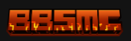

# ✨酱汁Minecraft集中营✨
这是一个分享 我的世界 游玩开始教程以及网站资源的营地.建立营地的目的仅是想要实现一个小白和大家能快速上手都能快乐游玩Minecraft,目前仍在开发阶段不过我相信一定可以做到最好到永远!!!😊

## 📦️ 安装
- 电脑PC端启动器[BBSMC下载源](https://bbsmc.net/softwares)

Plain Craft Launcher (PCL) 启动器 通过[BBSMC](https://bbsmc.net/)页面点击 https://bbsmc.net/software/pcl 下载 (推荐)

PCL 社区版（PCL CE）       启动器 通过BBSMC页面点击 https://bbsmc.net/software/pcl-ce 下载 (推荐)

Hello Minecraft! Launcher (hmcl)启动器 通过BBSMC页面点击 https://bbsmc.net/software/hmcl 下载 (推荐)

X Minecraft Launcher    启动器 通过BBSMC页面点击 https://bbsmc.net/software/x-minecraft-launcher 下载

Yu Minecraft Launcher  启动器 通过BBSMC页面点击 https://bbsmc.net/software/ymcl 下载

LauncherX                启动器 通过BBSMC页面点击 https://bbsmc.net/software/launcherx 下载

Xbox官方正版 [Minecraft我的世界](https://www.minecraft.net/zh-hans)页面点击https://www.xbox.com/zh-CN/games/store/minecraft-java-bedrock-edition-for-pc/9nxp44l49shj  下载 (支持正版 | 要钱!)

Plain Craft Launcher (PCL) 启动器 通过[爱发电](https://aifadian.qingmo.net/)页面[龙腾猫跃](https://afdian.com/a/LTCat)共产主义大佬主页https://afdian.com/p/0164034c016c11ebafcb52540025c377 下载 (推荐)

- 手机Android端

Foldcraft launcher简称FCL启动器，作为一款针对于移动端设备运行Minecraft Java 版的工具其下载网站 https://foldcraftlauncher.cn (功能可玩性高,推荐)

Minecraft 基岩版, 是一个更注重便捷性、可及性和社交性的版本支持官方Xbox登录其[苦力怕论坛](https://klpbbs.com/)下载https://mcapks.net/ (稳定,简单)

我的世界网易版[链接](https://mc.163.com/) , 中国网易游戏代理 是一款在便捷性和合规性上做得非常出色，但在游戏自由度和核心体验上做出了巨大妥协的“特供版”Minecraft。它极大地降低了中国玩家的入门门槛，但同时也为资深玩家和社区创作者戴上了枷锁。网易版社区的深度讨论、顶级技术力作品和极度硬核的模组相对较少,性能与优化大问题! (难评)

## 🔗 MC网站目录

🚧(仅部分我用的推荐)

# 点击👉[酱汁的网站](https://lin4813.github.io/Minecraft/) 
- 我自己建于GitHub的MC网站主要是(数据包 网站 美图 MOD分享等)与自己的服务器内容!欢迎参观食用 ♡(>ᴗ•)

## 下面是网络上较大的MC网站 | 点击图片前往

 

1. MC百科 (mcmod.cn) 的目标是为玩家提供更好的环境进行MOD学习和研究，并接纳、培养更多硬核玩家。提供Minecraft(我的世界)MOD(模组)物品资料介绍、教程攻略与MOD下载，致力于提高玩家的游戏体验。

 

2. odamc是玩家自发组织搭建的网站,管理有序MOD和地图,服务器等居多,分享MInecraft事件趣闻接纳、培养更多硬核玩家同时也有资料介绍、教程攻略与MOD下载。

3. BBSMC网站是地图、模组、材质包、皮肤等玩家自制资源的聚集地。玩家可以在这里找到稀有资源，或者发布自己的创作，获得来自社区的反馈和认可,是目前较大的下载站。
   

4. 苦力怕论坛  是当前中文Minecraft社区中资源最丰富、生态最完善、用户活跃度最高的综合性论坛之一，堪称“国内的MCBBS”。 它在玩家、开发者和管理者之间建立了一个非常良性的循环。虽然高质量内容很多，但由于用户基数大，水贴、低质量提问和重复资源也同样存在。用户需要具备一定的辨别能力，并善用搜索功能。这里是宣传和招募的必驻之地。

5. modrinth  评价Minecraft开始的地方 Modrinth是现代、安全、高效的 Minecraft 模组发布平台，被誉为模组领域的“未来之星”，是继 CurseForge 之后最具革命性和开发者友好型的平台。 它代表了 Minecraft 模组分发的新方向和更高标准。开发团队非常活跃，不断根据社区反馈添加新功能和优化体验,它代表了 Minecraft 模组生态的未来发展方向，是当前环境下高度值得推荐和赞扬的宝藏平台!

 🙏赞助 (Sponsors)

